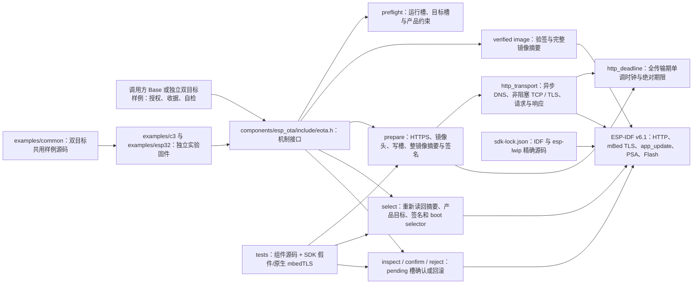

# ESP OTA

`esp-ota` 是独立的 ESP-IDF 签名应用升级组件。`components/esp_ota` 提供 `eota_` API，使用官方 `esp_http_client`、`app_update`、分区和 PSA SHA-256；应用继续负责授权、持久操作收据、业务静止、自检窗口和重启。当前处于开发阶段，host 故障测试与双目标离线构建不代表实板升级已验收。

## 架构拓扑



准备阶段用 IDF 写 inactive 应用槽并验证完整 signed bin，**不切启动槽**；`esp_ota_begin` 可能清除该槽原有的 otadata 记录。与 Container 联合升级时，调用方先持久登记并读回 OTA 收据，再用 `eota_retire_inactive` 在写新固件前精确退役旧备用镜像，经签名/otadata 读回证明后才退役旧 Container 绑定；中途断电由调用方按原收据重入对账。应用可在两阶段之间持久提交与业务包的绑定；`eota_select` 再核对实际槽、摘要、当前可信产品约束与 IDF 签名，并显式切槽。切槽失败时库恢复旧运行槽的 VALID 状态并清除未启动候选的 NEW 状态，读回不确定则明确报错。库不创建 worker、不写业务 NVS、不管理 Wasm 包，也不替应用决定何时确认新固件。具体调用合同见 [API 说明](docs/design/api-contract.md)。

## 独立构建

本仓不需要相邻 Base、FRP、MQTT、Container 或私有 Tool 才能运行 host 回归：

```bash
cmake -S . -B build -DBUILD_TESTING=ON
cmake --build build
ctest --test-dir build --output-on-failure
```

有锁定 SDK 后，可另跑真实 mbedTLS HTTPS 回环：

```bash
cmake -S . -B build-real-https -DBUILD_TESTING=ON -DEOTA_REAL_HTTPS_TEST=ON
cmake --build build-real-https
ctest --test-dir build-real-https --output-on-failure
```

此入口读取 `IDF_PATH`、核对 `sdk-lock.json`，并使用本机 Python 与 OpenSSL 生成临时测试 CA；不会连接外网或设备。

IDF 组件位于 `components/esp_ota`，`idf_component.yml` 固定 ESP-IDF 6.1.0；[SDK 锁](components/esp_ota/sdk-lock.json)还固定公开 ESP-IDF fork `578cf89c343e388db43ba1f4ddcd602fedcb763c` 和公开 `esp-lwip` 提交。fork 从官方 `fff9895c82d744c7237be8847347bdd1b07c6643` 派生，修复 `esp_ota_begin` 擦除失败后的句柄泄漏，以及 HTTP 客户端初始化时内建 TCP／TLS transport 注册失败后的句柄泄漏。构建守卫核对两份源码和 lwIP 以外的干净状态，防止用另一套 SDK 误报组合结果。签名 OTA 消费者还须启用 `CONFIG_ESP_HTTP_CLIENT_ENABLE_CUSTOM_TRANSPORT=y`；样例默认配置已启用。`CONFIG_BOOTLOADER_APP_ANTI_ROLLBACK` 在本组件的 IDF 构建中明确拒绝，因为 SDK 的确认入口在该配置下可能写 eFuse。已备好锁定 SDK 后：

```bash
python3 components/esp_ota/tools/check_sdk.py --path "$IDF_PATH"
idf.py -C examples/c3 build
idf.py -C examples/esp32 -B build-esp32 build
```

[共用样例源码](examples/common/README.md)分别装配到 [独立 C3 样例](examples/c3/README.md)与 [独立 ESP32 样例](examples/esp32/README.md)。C3 保持已核对的 4 MiB 双应用槽事实；ESP32 默认只读编译，不假定第二台设备的分区。两者默认都不写 Flash 或 otadata；受控测试需要各板仓外输入、受控签名构建、已授权设备和恢复基线。编译、host 假件和临时测试键都不授权刷板、改分区、eFuse 或生产密钥操作。新 Container 布局须另行验证后由调用方更新可信约束。

## 当前验证边界

- host ASan/UBSan 测试覆盖槽预检、准备与切槽分离、镜像头/长度/摘要/签名、HTTP 中断、SDK 错误、恢复读回及 pending 确认；真实 transport 源码配本地 socket 与 TLS/DNS 假件核对超时、迟到回调、慢滴流及清理顺序。另有固定 SDK 源码构建的真实 mbedTLS HTTPS 回环，验证 CA、SNI/证书名、握手期限及响应慢滴流；测试 CA 通过 host 适配入口注入，未调用设备侧证书 bundle。具体见[测试说明](tests/README.md)。
- C3 与 ESP32 的普通构建、`chip_id=0` 故障回归及仓外临时测试键签名构建均已在固定 SDK 下通过；C3 使用 RSA-3072，ESP32 使用 ECDSA v1。离线验签只证明生成的镜像与测试键相符，不含设备写入，也不证明当前 ESP32 旧 AT bootloader 能运行该镜像。两板完整 HTTPS、Flash、bootloader、回滚与恢复链路仍待分别实板验收。
- 准备阶段从槽预检前记录单调时钟起点；异步 DNS、非阻塞 TCP、mBed TLS 握手、请求发送、响应头和响应体共用绝对总期限与无进展期限，TCP/TLS 建连另受连接期限约束。每次读写另以 SDK 的 `read_timeout_ms` 建立单次绝对截止，TLS 记录持续慢滴流或 TLS 1.3 连续会话票据不能反复重置该期限；`select` 只等待这些期限的最短剩余时间。到达旧无进展期限的迟到字节不能刷新期限。Flash 擦除、写入、读回、验签及清理调用返回后也检查同一下载期限，逾期不返回可切槽的准备结果。传输不创建到期定时器，调用栈退出后由传输所有者关闭 socket。设备侧 TLS 使用默认 CA bundle、强制证书验证及 URL 原主机名的 SNI/证书名校验。固定 SDK 的 `close`、密码学单步、HTTP 解析和 Flash 调用不能由本库抢占，30 秒无进展和 5 分钟总期限不构成 `eota_prepare` 的严格墙钟返回保证。真实 HTTPS host 回环与 C3 编译仍不能代替设备上的完整 HTTP/Flash/bootloader 证据；P5-04 与实板升级、回滚、Base 接入仍未验收。

源码与测试从 Base 已提交源码迁入的来源和改造边界见[来源记录](docs/design/source-provenance.md)。工作区完整阶段与验收条件以[五仓主计划](https://github.com/darren-you/darren-space/blob/master/harness/docs/design/darren-space/global/esp-base-frp-mqtt-ota-container-development-plan.md)为准。
本轮编译与 host 测试的精确结果见[开发检查点](docs/operations/development-checkpoint.md)。
当前双目标离线构建与验签结果见[开发检查点](docs/operations/development-checkpoint.md)；C3 的历史签名验证见 [P5-03 签名构建复验](docs/verification/p5-03-signed-c3.md)。
